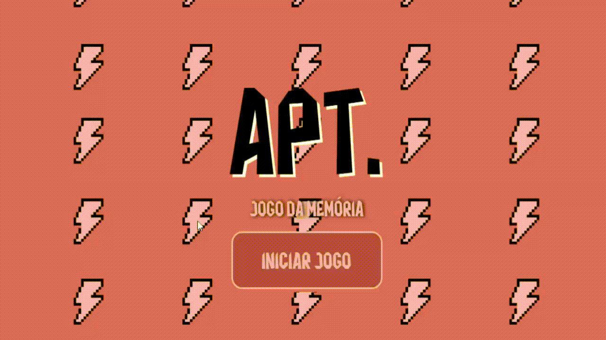

# 🎲 JOGO DA MEMÓRIA — APT. 

Este é um jogo da memória temático, inspirado em **APT. de Rosé e Bruno Mars**, com interações animadas e efeitos personalizados. Criado em **HTML**, **CSS** e **JavaScript puro**, é ideal para treinar lógica de programação e manipulação de elementos DOM.

> ➥ STATUS: Em andamento

---

## 📸 Prévia

> 

---

## 🎮 Como Jogar

1. Clique em **Iniciar Jogo**.
2. Aguarde a contagem animada.
3. Encontre os **8 pares de cartas** antes do tempo acabar.
4. Se completar a tempo, você vence!
5. Clique em **Jogar Novamente** para recomeçar.

---

## 🧠 Funcionalidades

- ⏱️ Contador regressivo de 60 segundos
- 🎞️ Animação de contagem estilo apresentação
- 🔄 Embaralhamento automático das cartas
- 🔁 Sistema de virada e verificação de pares
- 🎨 Visual temático com fontes e animações
- 🎉 Efeito visual de elementos caindo
- 🏁 Mensagens de vitória ou derrota
- 🔁 Botão para reiniciar a partida

---

## 🛠️ Tecnologias Utilizadas

- HTML5
- CSS3 (animações, variáveis, `@keyframes`)
- JavaScript Puro (sem bibliotecas externas)
- Fontes personalizadas:
  - Jersey10
  - Flamengo 2021
  - BlackHanSans

---

## 🚀 Como Executar

1. Baixe ou clone o repositório:
   ```bash
   git clone https://github.com/manuoliveiraofficial/Jogo-da-memoria.git
Abra o arquivo index.html em qualquer navegador moderno.

Jogue e divirta-se! 🎲

## 📌 Futuras Melhorias

1. Suporte completo a dispositivos móveis
2. Trilha sonora e áudio de vitória e clique
3. Sistema de pontuação e recorde
4. Adição de níveis

## 👩‍💻 Autoria

Desenvolvido por Manu Oliveira - Projeto autoral criado com foco em lógica, design e diversão.
> Todas as artes do jogo são autorais. Não utilizar sem autorização.